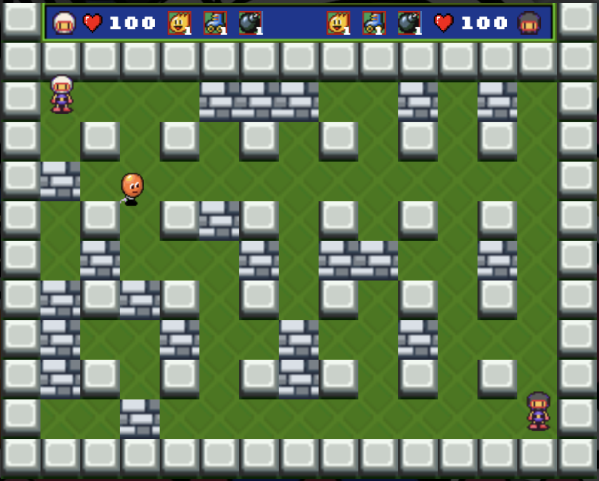

# Project - 1: Bomberman Clone
#### TLDR: https://danielcspaiva.github.io/Bomberman-Clone/
 
## Getting Started
This project is a Bomberman clone built with vanilla Javascript, HTML and CSS as part of the Ironhack Web Development bootcamp. These instructions will get you a copy of the project up and running on your local machine for development and testing purposes. You can also [click here](https://danielcspaiva.github.io/Bomberman-Clone/) to check it out!

## Screenshot

## Installing

Clone or download this repository. Run the index.html and let me know what you think.

## Instructions

You control a character that places bombs that explode after a few seconds and can kill enemies. Enemies will spawn in random locations, wander around and give you damage if they touch you, so avoid them and kill them with your bombs.

Everytime you kill an enemie there is an 80% chance of it dropping a power up. There are three Power-ups that can increase your bomb capacity, bomb reach and player speed.

On single player mode your goal is to kill as many enemies as possible. On multiplayer mode your goal is to defeat the other player. 

The controls are as follows:

Player 1:
* Move: Arrow keys.
* Place Bomb: Spacebar.

Player 1:
* Move: a, w, s, d.
* Place Bomb: q.

## Contributing

This is an open source project, feel free to fork it, make changes and submit a pull request.

## Special thanks

Special thanks to all Ironhack São Paulo staff and students that helped me build this project.

## Disclaimer

This project was built solely for education purposes. I do not own any copyrights to Bomberman or any sprites or music in this project.

You can find the sprites and the music at: 
* https://www.spriters-resource.com/snes/sbomber5/
* https://downloads.khinsider.com/bomberman
